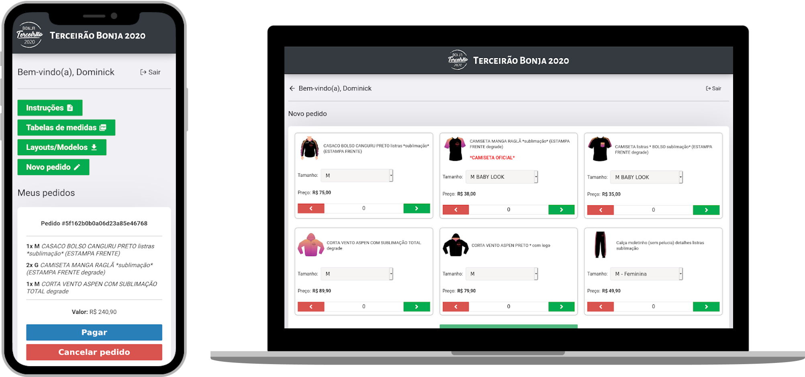

<h2 align="center">
  👕 Portal Terceirão Bonja 2020 
</h2>

  <a href="#🌐-tecnologias">Tecnologias</a>&nbsp;&nbsp;&nbsp;|&nbsp;&nbsp;&nbsp;
  <a href="#📕-projeto">Projeto</a>&nbsp;&nbsp;&nbsp;|&nbsp;&nbsp;&nbsp;
  <a href="#🤔-como-rodar">Como Rodar</a>&nbsp;&nbsp;&nbsp;|&nbsp;&nbsp;&nbsp;
  <a href="#📝-licença">Licença</a>

 

  

## 🌐 Tecnologias

Esse projeto foi desenvolvido com as seguintes tecnologias:

- [Node.js](https://nodejs.org/en/) / [Express](https://expressjs.com/)
- [React](https://reactjs.org)
- [JSON Web Tokens](https://jwt.io/)
- [MongoDB](https://www.mongodb.com/)
- [Redis](https://redis.io/)
- [Nodemailer](https://nodemailer.com/about/) / [Amazon SES](https://aws.amazon.com/ses/)
- [Pagar.me](https://pagar.me/)

## 📕 Projeto

&nbsp;&nbsp;&nbsp;&nbsp;&nbsp;&nbsp;&nbsp;&nbsp; O portal foi criado durante o meu último ano letivo, em meio a pandemia do COVID-19, com o intuito de facilitar o pedido do uniforme de terceirão durante o isolamento social.

&nbsp;&nbsp;&nbsp;&nbsp;&nbsp;&nbsp;&nbsp;&nbsp; Além de termos conseguido fechar as vendas e enviar os pedidos para a produção sem grandes problemas, este projeto também me proporcionou muito aprendizado técnico e burocrático, principalmente na área de pagamentos _online_ via boleto e cartão de crédito (criptografia de dados, captura de transações, _postback_, etc).

## 🤔 Como Rodar

- Clone o repositório: `git clone https://github.com/dominickbrasileiro/uniforme-bonja`;
 
- Na pasta _backend_, renomeie o arquivo _`.env.example`_ para _`.env`_;
- Em seguida, preencha todas as variáveis de ambiente no arquivo _`.env`_:
  - Atenção para a variável _`APP_SECRET`_, esta será usada como segredo para a geração e validação dos tokens JWT;
  - Atenção para a variável _`MIN_INSTALLMENT_AMOUNT`_, esta representa o valor mínimo para cada parcela no cartão de crédito, deve ser representada em números inteiros. (Ex: R$ 50,00 = 50);
- Após preencher as variáveis de ambiente, instale as dependências do _backend_ com o comando `yarn install` ou com seu gerenciador de pacotes de preferência;
- Inicie o _backend_ com o comando `yarn dev` para desenvolvimento ou `yarn start` para produção.
 
- Na pasta _frontend_, renomeie o arquivo _`.env.example`_ para _`.env`_;
- Em seguida, preencha todas as variáveis de ambiente no arquivo _`.env`_:
- Após preencher as variáveis de ambiente, instale as dependências do _frontend_ com o comando `yarn install` ou com seu gerenciador de pacotes de preferência;
- Inicie o _frontend_ com o comando `yarn start`.

## 📝 Licença

Esse projeto está sob a licença MIT. Veja o arquivo [LICENSE](LICENSE.md) para mais detalhes.

---

Feito por _[Dominick Brasileiro](https://discordapp.com/invite/gCRAFhc)_ 💎
